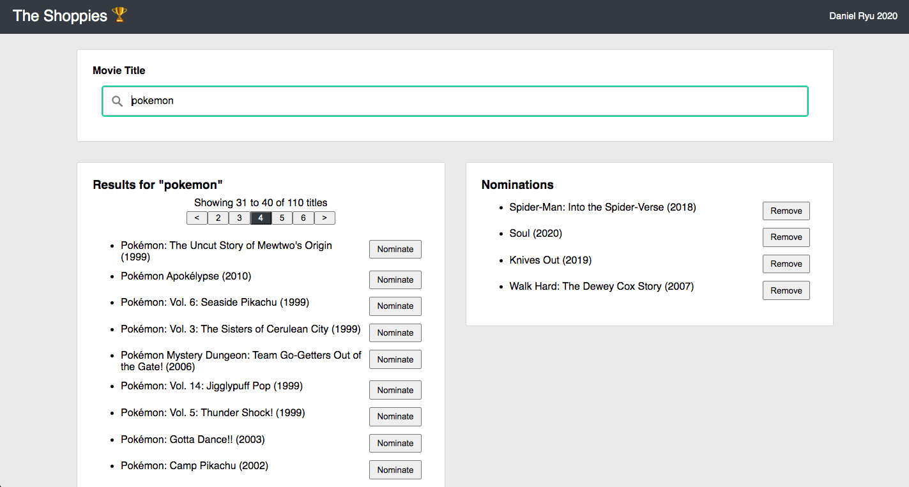

# The Shoppies 🏆

### 2021 Shopify challenge for Front-end Development

*"Build a webpage that allows users search for movies and nominate their favourite films."*

Check it out [here](https://dryu99.github.io/the-shoppies-2021/)!

## Tech Stack
- JavaScript
- React.js
- [styled-components](https://styled-components.com/)

I considered using TypeScript but decided against it because:
- The scope of the challenge was relatively small and I didn't want to over-engineer.
- I don't have much experience using TypeScript with React and wanted to focus on shipping a functioning product on time.
- I figured I could come back to refactor the codebase to use TypeScript later on if it felt appropriate.

## Additional Features
- **Pagination**:   

  Supporting pagination was my highest priority because I felt it was important that users could see all available results for a given search. The OMDb API only returns 10 results max for each search request, so if pagination wasn't implemented, users may not be able to find their desired movies. For example, users might try searching for movies with a partially complete title, or might choose to browse all movies that contain a given word.
- **Debounced Search**:  

  I felt there was unnecessary overhead occurring from making an OMDb API request every time the search input changed, since the request realistically only needed to be made once (when the user stops typing). After doing some research, I found out about debouncing and applied it to my search logic to help reduce unnecessary API requests and improve performance.
- **Save nominations if user leaves page**:

  Since the site is supposed to keep track of user selections, I thought it would be appropriate to persist their selections even after page close.

## Challenges
- **Deciding how to manage state**:

  I was very conflicted on handling state. I knew I wanted to localize state as best as I could and have clean state code, but was aware that sharing state between sibling components would be inevitable (e.g. current nominations). To achieve cleaner state management, I was very close to using a library like [Easy Peasy](https://easy-peasy.now.sh/) or React context hooks, but decided against it and decided to simply share state via component props. I felt I was getting ahead of myself given the scope of the project and figured I could always come back to refactor if necessary, but only after implementing the core requirements.

- **Reducing duplicated code between `Nominations` and `SearchResults` components**:

  While working through the project, I noticed that both components were essentially the same movie list, and only differed in their list content and buttons. I decided to create a more general `MovieList` component, but the problem was more complex than I thought because of the state logic tied to the buttons. I eventually settled on passing button function components into `MovieList`.

- **Implementing pagination and debounced search**:

  It was my first time implementing either of these features, so I found them challenging to work through. It felt very satisfying when I got it to work, especially after figuring out the calculations for pagination.

## Next Steps
Below is a list of things I would work on next if this had been a full-scale project with a longer timeline. I decided not to implement these features because I wanted to focus on delivering a functioning product on time and avoid over-engineering.

- Refactor to TypeScript
- Write UI tests (felt that manual tests sufficed for the MVP to check UI functionality given the small scope of the project)
- Manage state more cleanly with a library or React hooks
- Show more metadata for each movie
- Add 'Card View' and 'List View' options for movie list components
- Give users the option to see more than 10 movies in the search results
- Add filters to search bar (e.g. year, director)
- Mobile responsiveness
- Better web responsiveness for certain scenarios (e.g. tiny screens)
- More styling ooo

